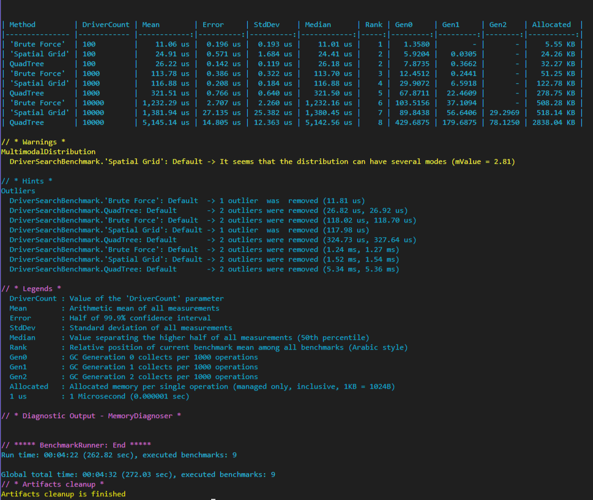

# Проект_1(такси) — Поиск ближайших водителей

## Описание работы
В проекте реализованы три алгоритма поиска пяти ближайших водителей:
- **Brute Force** (полный перебор)
- **Spatial Grid** (пространственная сетка)
- **QuadTree** (квадродерево)

## Покрытие тестами
Все алгоритмы покрыты модульными тестами с использованием **NUnit**.

## Результаты бенчмарков
